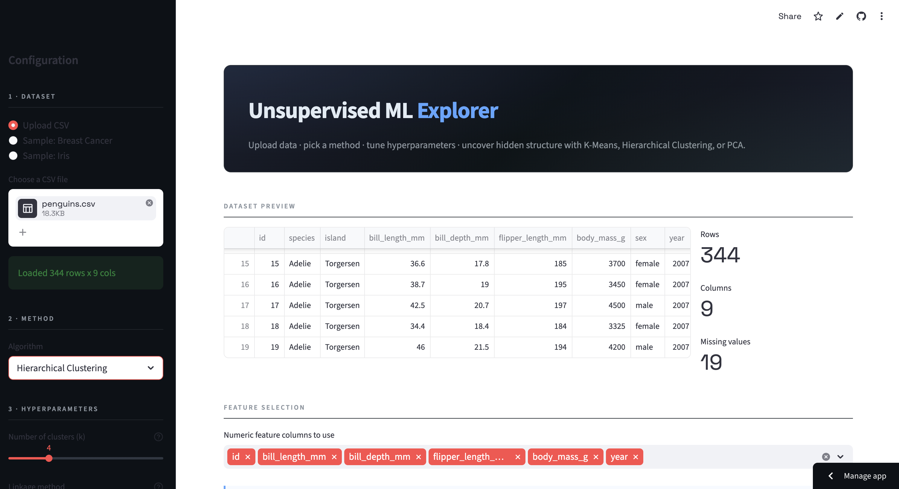
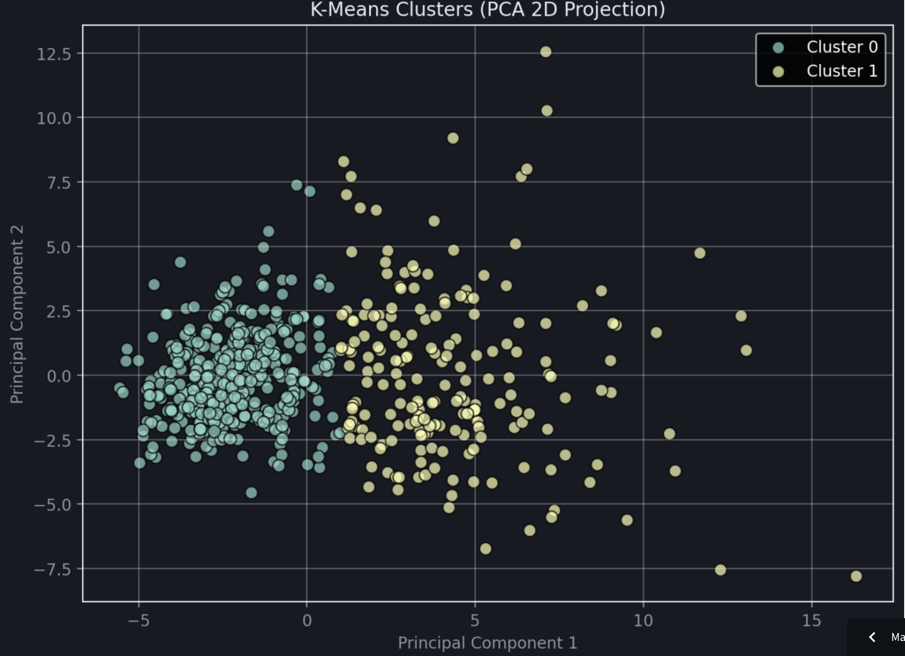
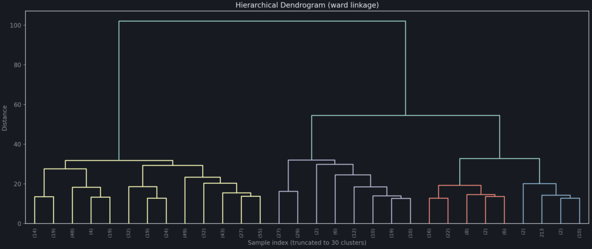
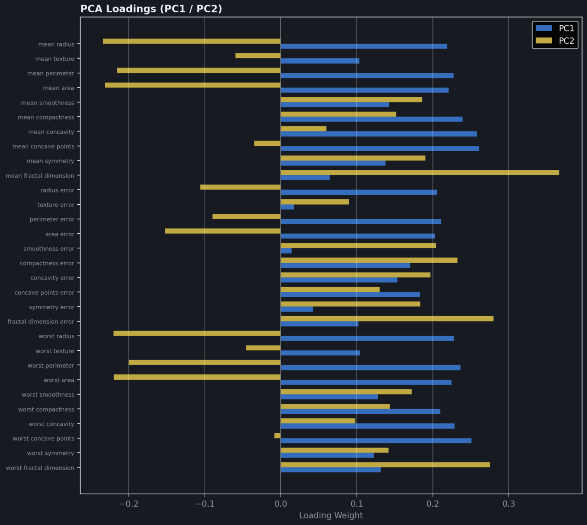

# Unsupervised ML Explorer

An interactive Streamlit web application for exploring three foundational unsupervised machine learning techniques — **K-Means Clustering**, **Hierarchical (Agglomerative) Clustering**, and **Principal Component Analysis (PCA)** — on any tabular dataset.

## Live Demo

**Try the deployed app here:** [https://luo-unsupervised-ml.streamlit.app](https://luo-unsupervised-ml.streamlit.app)

No installation required — upload your own CSV or experiment with the built-in Breast Cancer and Iris sample datasets directly in your browser.

---

## Project Overview

This project is the capstone of my Introduction to Data Science portfolio. It packages three core unsupervised learning algorithms into a single, interactive interface where users can:

- **Upload** their own tabular dataset (or use a built-in sample).
- **Choose** which unsupervised method to apply — K-Means, Hierarchical Clustering, or PCA.
- **Tune** the relevant hyperparameters (number of clusters, linkage method, number of components, random seed, etc.) using sliders and dropdowns in the sidebar.
- **Visualize** the results immediately through scatter plots, dendrograms, scree plots, elbow curves, silhouette score sweeps, and PCA loadings charts.
- **Compare** clustering results against ground-truth labels when using the sample datasets, to build intuition about how unsupervised methods behave.

The goal is to make these techniques tangible — instead of reading about them in a notebook, the user can move sliders and watch the math respond in real time.

---

## App Features

### 1. K-Means Clustering
Partitions the standardized data into `k` clusters by minimizing within-cluster sum of squares (inertia).

- **Hyperparameters exposed:** number of clusters `k`, `random_state`, `n_init` (number of random restarts).
- **Visualizations:** 2D PCA scatter colored by cluster, **elbow plot** of WCSS across `k = 2..10`, **silhouette curve** across `k = 2..10`, cluster size table.
- **Metrics:** silhouette score, inertia, sample count, and (when ground-truth labels exist) flip-aware accuracy comparing clusters to true classes.

### 2. Hierarchical Clustering
Builds a bottom-up tree of merges using `scipy.cluster.hierarchy.linkage` and cuts it at a user-chosen height with `AgglomerativeClustering`.

- **Hyperparameters exposed:** number of clusters `k`, **linkage method** (`ward`, `complete`, `average`, `single`), and a control to truncate the dendrogram for large datasets.
- **Visualizations:** **dendrogram** with cluster threshold highlighted, 2D PCA scatter colored by cluster, silhouette curve across `k = 2..10`, cluster size table.
- **Metrics:** silhouette score, chosen linkage, sample count.

### 3. Principal Component Analysis (PCA)
Projects the standardized data onto the directions of greatest variance.

- **Hyperparameters exposed:** number of components `n_components` (auto-capped at `min(n_samples, n_features)` for safety).
- **Visualizations:** **2D PCA scatter** (colored by true class when available), **scree plot** with dual axes (per-component bars + cumulative line), **loadings bar chart** showing how each original feature contributes to PC1 and PC2, full component variance table.
- **Metrics:** PC1 variance, total variance explained, original feature count.

### Hyperparameter Selection Philosophy

All defaults match what was used in our class notebooks — for example, K-Means defaults to `k = 2` (matching the Week 13 Breast Cancer demonstration) and Hierarchical defaults to `k = 4` with `ward` linkage (matching the Week 13 Democracy dataset demonstration). Each control includes a tooltip explaining what the parameter does and which class week it came from, so users can learn while they explore. Tuning is **manual and visual** rather than automated — the user sees the elbow plot or silhouette curve and decides which `k` looks right, building intuition that an automated grid search would hide.

---

## Screenshots

**App home and sidebar controls**



**K-Means: 2D PCA scatter colored by cluster, with elbow plot**



**Hierarchical clustering: dendrogram with cluster threshold**



**PCA: scree plot and loadings showing feature contributions to PC1/PC2**



---

## Run Locally

### Prerequisites
- Python 3.9 or newer
- `pip` (comes with Python)
- Git (to clone the repo)

### Step-by-step

```bash
# 1. Clone the portfolio repository
git clone https://github.com/lisaluo/Luo-Data-Science-Portfolio.git
cd Luo-Data-Science-Portfolio/MLUnsupervisedApp

# 2. (Recommended) Create and activate a virtual environment
python -m venv venv
source venv/bin/activate          # macOS / Linux
# venv\Scripts\activate           # Windows

# 3. Install dependencies
pip install -r requirements.txt

# 4. Launch the app
streamlit run ml.py
```

The app will open automatically at `http://localhost:8501`. Stop it any time with `Ctrl + C` in the terminal.

> **Note:** Streamlit apps must be run with `streamlit run ml.py`, **not** `python ml.py`. Running it as a plain Python script will not start the web server.

---

## Cloud Deployment

The app is deployed for free on **Streamlit Community Cloud**. To redeploy your own copy:

1. Fork or clone this repository to your own GitHub account.
2. Sign in to [share.streamlit.io](https://share.streamlit.io) with GitHub.
3. Click **New app** → select your repository, the `main` branch, and set **Main file path** to `MLUnsupervisedApp/ml.py`.
4. Click **Deploy**. Streamlit Cloud reads `requirements.txt` automatically and installs every listed library before launching the app.

Updates pushed to the `main` branch trigger automatic redeployment.

---

## Repository Structure

```
MLUnsupervisedApp/
├── ml.py               # Main Streamlit app (entry point)
├── requirements.txt    # Python dependencies for local + Cloud install
├── README.md           # This file
└── screenshots/        # Optional: app screenshots referenced above
```

---

## Dependencies

Listed in `requirements.txt`. Versions are intentionally left unpinned so the app installs cleanly across different Python versions on Streamlit Community Cloud.

| Library | Purpose |
|---|---|
| `streamlit` | Web UI framework — every widget, layout, and chart rendering |
| `pandas` | DataFrame loading, cleaning, manipulation |
| `numpy` | Numeric arrays and math operations |
| `scikit-learn` | `StandardScaler`, `PCA`, `KMeans`, `AgglomerativeClustering`, `silhouette_score`, sample datasets |
| `scipy` | `scipy.cluster.hierarchy.linkage` and `dendrogram` for hierarchical clustering |
| `matplotlib` | All plotting (scatter, elbow, scree, dendrogram, loadings) |
| `seaborn` | Supplemental styling helpers |

Tested locally on Python 3.9 and 3.13, and on Streamlit Community Cloud (Python 3.14).

---

## References

The implementation draws directly from the techniques covered in our Introduction to Data Science class notebooks:

- **Week 12.2** — Principal Component Analysis with `sklearn.decomposition.PCA`, scree plots, and loadings interpretation.
- **Week 13.1** — K-Means clustering with `sklearn.cluster.KMeans`, the elbow method, and silhouette analysis.
- **Week 13.2** — Hierarchical (Agglomerative) clustering with `scipy.cluster.hierarchy.linkage`, dendrograms, and Ward linkage.

Official documentation consulted:

- [scikit-learn: Clustering user guide](https://scikit-learn.org/stable/modules/clustering.html)
- [scikit-learn: PCA documentation](https://scikit-learn.org/stable/modules/generated/sklearn.decomposition.PCA.html)
- [scikit-learn: KMeans documentation](https://scikit-learn.org/stable/modules/generated/sklearn.cluster.KMeans.html)
- [scikit-learn: AgglomerativeClustering documentation](https://scikit-learn.org/stable/modules/generated/sklearn.cluster.AgglomerativeClustering.html)
- [scikit-learn: Silhouette analysis example](https://scikit-learn.org/stable/auto_examples/cluster/plot_kmeans_silhouette_analysis.html)
- [SciPy: Hierarchical clustering reference](https://docs.scipy.org/doc/scipy/reference/cluster.hierarchy.html)
- [Streamlit documentation](https://docs.streamlit.io/)
- [Streamlit Community Cloud deployment guide](https://docs.streamlit.io/deploy/streamlit-community-cloud)

---

## About This Project

This app is part of my data science portfolio for the Introduction to Data Science course at the University of Notre Dame. It builds directly on my earlier supervised-learning Streamlit app and demonstrates the full lifecycle of an interactive ML project — from data preprocessing through model selection, hyperparameter tuning, evaluation, and deployment.

**Portfolio repository:** [Luo-Data-Science-Portfolio](https://github.com/lisaluo/Luo-Data-Science-Portfolio)

---

## License

This project is released for educational use as part of a course portfolio.